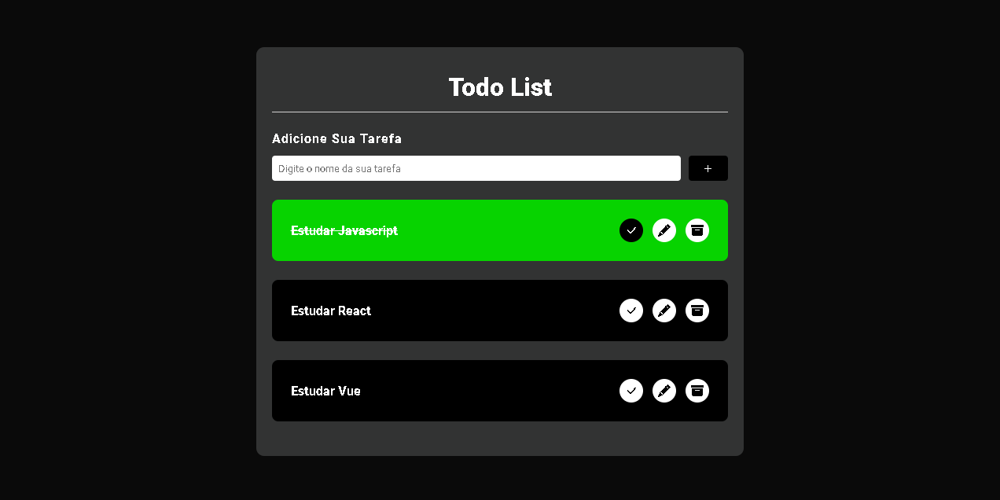

**Aplicativo de Lista de Tarefas**

Um aplicativo simples de lista de tarefas construído com HTML, CSS e JavaScript. Este aplicativo permite aos usuários adicionar, editar, remover e marcar tarefas como concluídas.

## Sumário

- [Recursos](#recursos)
- [Demonstração](#demonstração)
- [Instalação](#instalação)
- [Uso](#uso)
- [Contribuição](#contribuição)
- [Licença](#licença)

## Recursos

- **Adicionar Tarefa:** Os usuários podem adicionar novas tarefas à lista de afazeres.
- **Editar Tarefa:** Editar o nome de uma tarefa existente.
- **Remover Tarefa:** Remover uma tarefa da lista.
- **Marcar como Concluída:** Marcar tarefas como concluídas para facilitar o acompanhamento.

## Demonstração



Você pode visualizar uma demonstração ao vivo da Lista de Tarefas [aqui](#).

## Instalação

1. Clone o repositório:

   ```bash
   git clone https://github.com/seu-nome/todo-list.git
   ```

2. Navegue até o diretório do projeto:

   ```bash
   cd todo-list
   ```

3. Abra o arquivo `index.html` em seu navegador da web preferido.

## Uso

1. **Adicionar uma Tarefa:**
   - Digite o nome da tarefa no campo de entrada.
   - Clique no botão "Adicionar" ou pressione Enter.

2. **Editar uma Tarefa:**
   - Clique no botão "Editar" ao lado da tarefa.
   - Atualize o nome da tarefa no campo de entrada.
   - Clique no botão "Salvar".

3. **Remover uma Tarefa:**
   - Clique no botão "Excluir" ao lado da tarefa.

4. **Marcar como Concluída:**
   - Clique na caixa de seleção ao lado da tarefa para marcá-la como concluída.
   - Tarefas concluídas terão um efeito de riscado.

## Contribuição

Contribuições são bem-vindas! Por favor, siga as [Diretrizes de Contribuição](CONTRIBUTING.md).

## Licença

Este projeto está licenciado sob a [Licença MIT](LICENSE).
